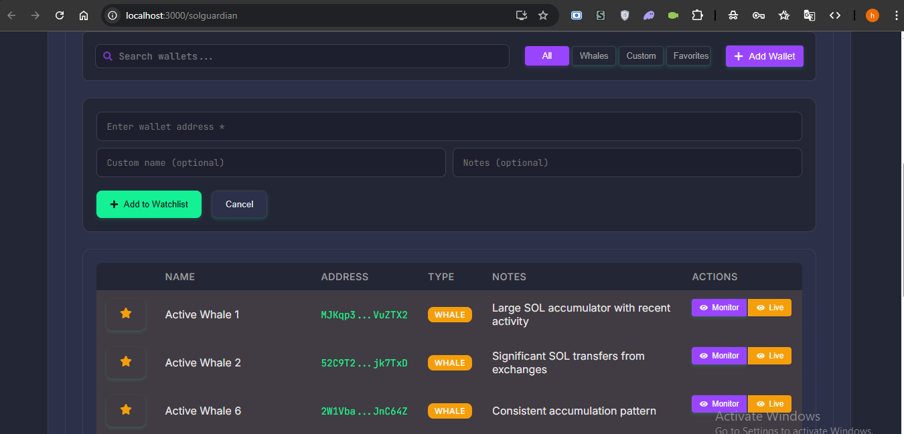

# SolGuardian - Making Solana's Data Layer Accessible

## Project Summary

SolGuardian directly challenges the misconception that "Solana's data layer is too complex" by providing an intuitive, real-time monitoring dashboard that transforms raw blockchain data into actionable insights. By leveraging Solscan's comprehensive APIs, we've created a powerful tool that makes whale activity tracking, wallet profiling, and transaction flow visualization accessible to everyone - from casual users to professional analysts.

Our project demonstrates that with the right approach and tools, Solana's on-chain data can be not only accessible but also incredibly valuable for understanding market dynamics, identifying significant movements, and enhancing transparency across the ecosystem.

## Problem Statement & Hackathon Focus

Monitoring large transactions and whale activity on Solana is challenging due to:
- High transaction volume making it difficult to identify significant movements
- Lack of accessible tools for real-time monitoring of whale activity
- Difficulty in understanding transaction patterns and wallet behaviors

SolGuardian directly addresses the "Whale Activity & Token Flow Monitoring" focus area of the Solscan Monitoring Masters hackathon, demonstrating that Solana's data layer is accessible and valuable when leveraged with the right tools.

## Our Solution

SolGuardian addresses these challenges by providing:
1. A dedicated Whale Watchlist for tracking known large holders
2. Advanced wallet profiling with behavior tagging
3. Transaction flow visualization showing movement between wallets, exchanges, and DEXs
4. Real-time monitoring of large transactions with configurable thresholds

## Key Features

### Whale Watchlist

- Pre-populated list of known whale wallets
- Custom watchlist management
- Quick access to detailed transaction history

### Wallet Profiling

- Behavior analysis based on transaction patterns
- Metrics including average transfer size and frequency
- Visual indicators of wallet activity type

### Transaction Flow Analysis

- Visualization of token movement
- Categorization by destination type (exchanges, DEXs, whales)
- Percentage breakdown of incoming/outgoing flows

### Live Whale Tracker

- Real-time monitoring of large transactions
- Configurable thresholds and refresh intervals
- Automatic pause on significant activity detection

All these features are demonstrated in the video walkthrough.

## Technical Implementation

### Architecture
SolGuardian is built as a React-based web application with a focus on real-time data processing and visualization:

- **Frontend**: React.js with functional components and hooks
- **State Management**: React Context API for global state
- **Data Visualization**: Chart.js for trend analysis
- **Styling**: Custom CSS with responsive design

### Solscan API Integration
SolGuardian leverages Solscan's comprehensive APIs to fetch and analyze on-chain data:

- `/account/transfer` - For wallet transaction history
- `/account/token-accounts` - For token holdings
- `/transaction/last` - For real-time transaction monitoring
- `/token/defi/activities` - For DEX activity monitoring

### Data Flow & Optimization
1. **Data Collection**: Fetch transaction data from Solscan APIs
2. **Processing**: Normalize and deduplicate transaction data
3. **Analysis**: Apply filtering, categorization, and pattern detection
4. **Visualization**: Present insights through intuitive UI components

Our application implements intelligent caching and pagination to minimize API calls while maintaining data freshness, and uses a configurable polling system for real-time updates without overwhelming the API.

### Challenges Overcome
- **API Rate Limiting**: Implemented smart caching and request deduplication
- **Large Dataset Handling**: Developed optimized data processing utilities
- **Real-time Updates**: Created a polling system with automatic pause/resume

## Impact & Relevance

### Ecosystem Benefits
SolGuardian enhances transparency and security in the Solana ecosystem by:

1. Making whale activity visible and trackable
2. Providing insights into transaction patterns and wallet behaviors
3. Enabling users to monitor significant movements that could impact the market
4. Demonstrating the accessibility of Solana's on-chain data through Solscan's APIs

### User Benefits
- **Traders**: Gain insights into market-moving transactions before they impact prices
- **Researchers**: Analyze wallet behavior patterns and transaction flows
- **Security Analysts**: Identify suspicious activity and unusual patterns
- **Newcomers**: Understand Solana's data layer through intuitive visualizations

### Hackathon Alignment
SolGuardian directly supports the hackathon's goal of demonstrating that "Solana's data layer is too complex" is a misconception. By transforming raw on-chain data into actionable insights through an intuitive interface, we show that Solana's data can be accessible and valuable to all users.

## Demo & Links

### Video Walkthrough
Our comprehensive video demonstration showcases all key features of SolGuardian in action:

**[▶️ Watch SolGuardian Demo Video](videos/solguardian-demo.mp4)**

The video covers:
- Setting up and navigating the Whale Watchlist
- Analyzing wallet profiles and behavior patterns
- Visualizing transaction flows between wallets, exchanges, and DEXs
- Monitoring large transactions in real-time with the Live Whale Tracker

### Live Application & Source Code
- [Live Demo](https://harpal88.github.io/solguardian): Interactive application deployment
- [GitHub Repository](https://github.com/harpal88/solguardian): Source code and documentation

## Team

- Developer: Harpal Singh
- Contact: harpalsingh7984@gmail.com

## Acknowledgments

- Solscan for providing the comprehensive APIs that power this application and organizing the Monitoring Masters hackathon
- Special thanks to the Solscan team for their excellent API documentation and support
- Solana Foundation for building an incredible blockchain ecosystem
- The Solana developer community for their valuable resources and inspiration

